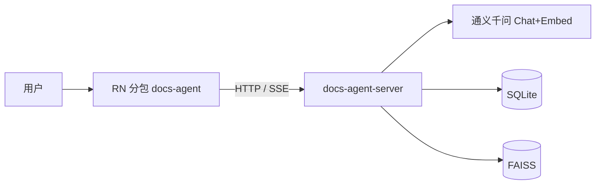
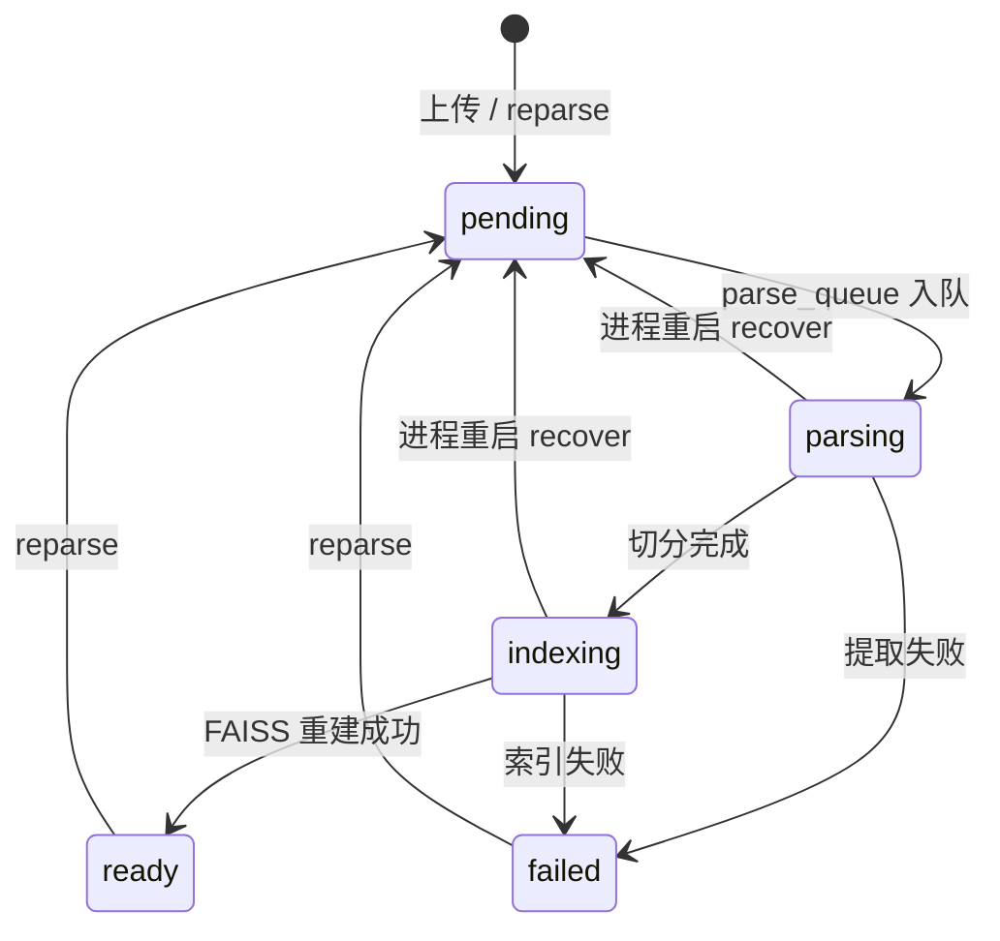
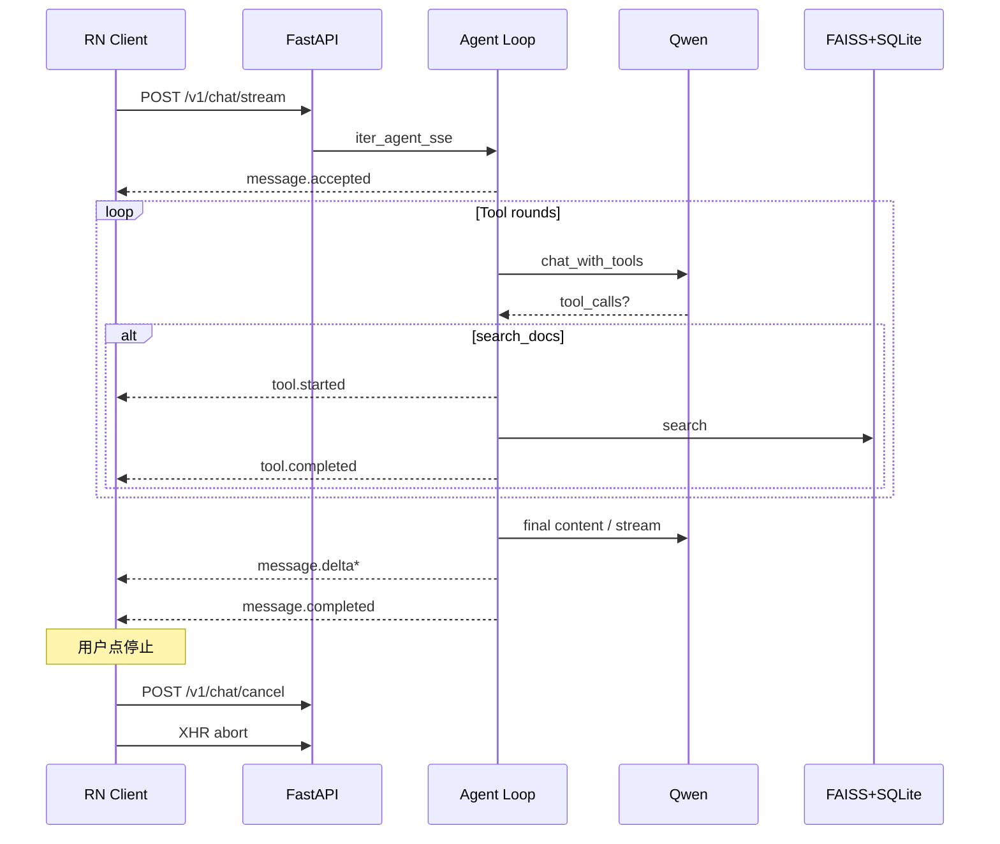
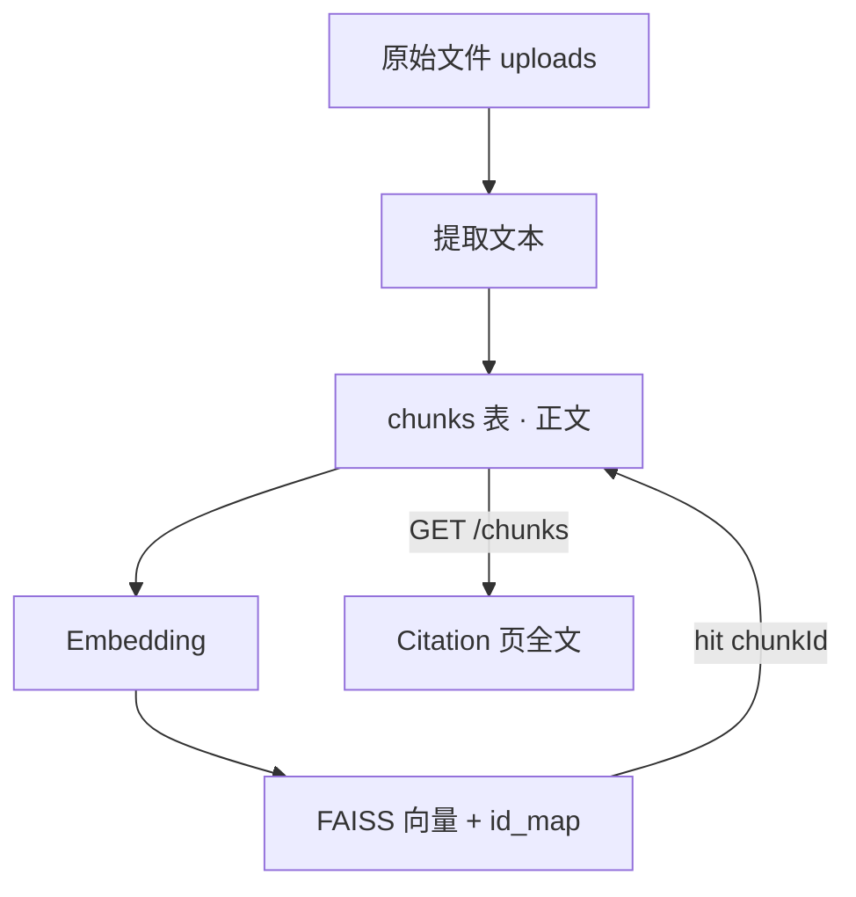
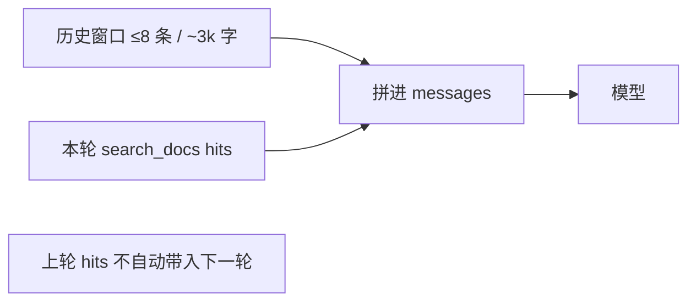

# 架构图（Diagrams）

可用支持 Mermaid 的编辑器预览（VS Code / GitHub / Notion）。导出 PNG：在预览里右键复制图，或用 [mermaid.live](https://mermaid.live) 导出。

## 1. 系统上下文

## 2. 文档解析状态机

## 3. 一次 SSE 问答

## 4. 数据分工（单一事实来源）

## 5. 记忆 vs 检索

导出建议文件名：`docs-agent-arch-context.png`、`docs-agent-sse-seq.png`（放作品集或面试投屏）。
